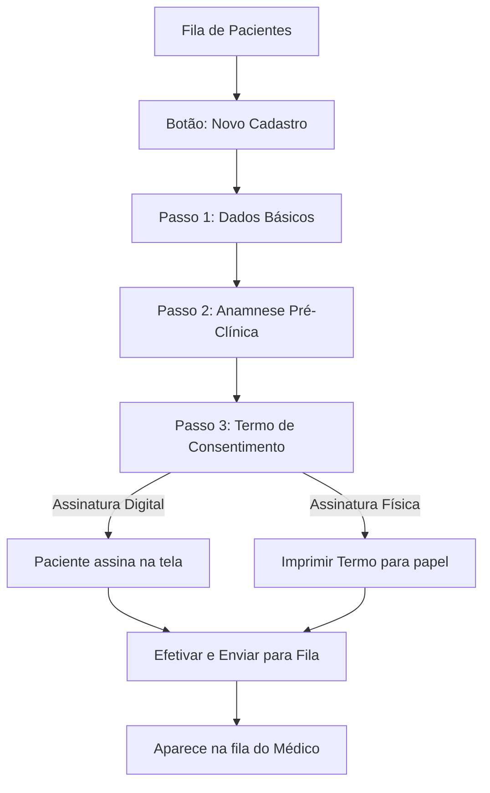
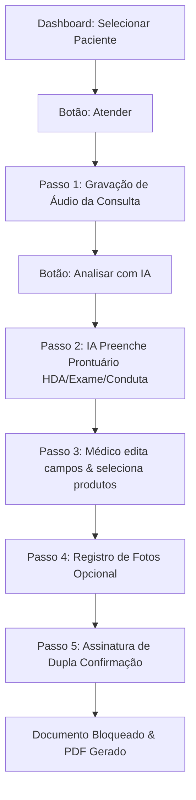

# 🩺 Manual do Usuário — prontuar.IO

Bem-vindo ao **prontuar.IO**, o sistema de prontuário eletrônico inteligente estruturado por voz e Inteligência Artificial. Este manual foi desenvolvido de forma direta e visual para auxiliar **recepcionistas (secretárias)** e **profissionais de saúde (médicos)** a operarem a plataforma com facilidade e segurança.

---

## 🔑 Acesso ao Sistema (Login)

Todos os usuários entram pela tela inicial de login (`login.html`).

1. **Campos de Acesso**:
   * Insira seu **E-mail (Usuário)** e **Senha**.
   * *(Opcional)* Clique no ícone de olho (<i class="ph ph-eye"></i>) para conferir a senha digitada.
   * Clique no botão **Entrar**.
2. **Direcionamento Automático**:
   * Se os seus dados estiverem cadastrados como **Médico**, você será direcionado para o **Painel Médico** (`medico-dashboard.html`).
   * Se for um usuário de **Recepção/Secretaria**, você será direcionado para o **Painel de Recepção** (`recepcao.html`).
3. **Modo Escuro**: 
   * No canto superior direito, clique no botão de lua/sol (<i class="ph ph-moon"></i>) para alternar o tema do sistema entre Claro e Escuro (Dark Mode).

---

## 👥 1. Módulo Recepção (Secretária)

A recepção é responsável por cadastrar os pacientes, realizar a triagem (anamnese inicial), coletar a assinatura do termo de consentimento e enviá-los para a fila de atendimento do médico.

### 📋 Passo a Passo para Cadastrar e Agendar um Paciente

#### **Passo 1: Preenchimento de Dados Básicos**
No formulário da lateral esquerda (ou topo no mobile):
1. **Nome Completo\***: Digite o nome do paciente. O sistema formatará automaticamente para *Title Case* (ex: "paulo silva" vira "Paulo Silva").
2. **Data de Nascimento\***: Insira a data (DD/MM/AAAA).
3. **Telefone\***: Digite o telefone com DDD.
4. **Cidade e UF**: Insira a localidade do paciente.
5. **Sexo**: Selecione no menu suspenso.
6. **Convênio**: Selecione o convênio (o padrão é "Particular").
7. **Responsável Legal**: Preencha apenas se o paciente for menor de idade ou necessitar de acompanhante (insira Nome e Parentesco).
8. **Médico Responsável**: Selecione qual médico fará o atendimento.

#### **Passo 2: Triagem / Anamnese Pré-Clínica**
Ao clicar no botão verde **Cadastrar e Enviar para Fila**, um pop-up com a **Anamnese** se abrirá:
1. Marque os checkboxes das condições de saúde declaradas pelo paciente (ex: *Diabetes*, *Hipertensão*, *Alergias*, *Marca-passo*, etc.).
2. Selecione o **Tipo de Pele** clicando nos botões de seleção (*Seca*, *Mista*, *Oleosa*, *Normal*).
3. Caso existam, descreva nos campos de texto: *Medicamentos de Uso Contínuo*, *Cirurgias Anteriores*, *Condições de Pele* ou *Observações Gerais*.
4. Clique no botão verde **Avançar para o Termo**.

---

#### **Passo 3: Assinatura do Termo de Consentimento**
Na janela do Termo de Consentimento, selecione o método de coleta de assinatura nas abas superiores:

##### **Opção A: Assinatura Digital (Recomendado)**
1. Mantenha o seletor no modo **Digital**.
2. Clique na aba **Assinar** no topo.
3. Peça para o paciente desenhar a assinatura no quadro branco utilizando o dedo (se estiver usando tablet/celular) ou o mouse (computador).
   * *Se errar:* Clique no botão vermelho **<i class="ph ph-trash-simple"></i> Limpar** no canto superior do quadro e assine novamente.
4. O sistema carregará automaticamente a assinatura e carimbo do médico no campo ao lado.
5. Marque o checkbox: **"Eu, [Nome do Paciente], confirmo que li, assinei e aceito..."**.
6. Clique no botão verde **Efetivar e Enviar**.

##### **Opção B: Assinatura Física**
1. Mude o seletor para o modo **Físico**.
2. Clique no botão azul **<i class="ph ph-printer"></i> Imprimir Termo**.
3. O sistema abrirá a tela de impressão do navegador sem as assinaturas digitais, pronta para o papel.
4. Com a folha impressa e assinada fisicamente pelo paciente, marque o checkbox de confirmação na tela da recepção.
5. Clique no botão verde **Efetivar e Enviar**.

> [!NOTE]
> Após clicar em **Efetivar e Enviar**, uma tela animada de sucesso aparecerá por 4 segundos confirmando o agendamento. O paciente irá automaticamente para a fila activa do médico selecionado.

---

### 🔍 Gerenciar Fila e Histórico de Pacientes

* **Barra de Busca**: Digite o nome, telefone ou convênio no campo **Buscar paciente...** para encontrar registros rapidamente.
* **Filtros rápidos**: Filtre a fila clicando em **Todos**, **Aguardando** ou **Finalizados**.
* **Visualizar Perfil e Histórico**: Clique no nome de qualquer paciente na fila para abrir a aba lateral de detalhes:
  * **Documentos**: Exibe o status da anamnese e do termo de consentimento (*"ACEITO E ASSINADO"* ou *"RECUSADO / PENDENTE"*).
  * **Reimprimir**: Se o paciente já assinou digitalmente, clique em **Reimprimir Termo** para obter uma cópia física contendo a assinatura digital impressa com carimbo de data, hora e IP de auditoria.
  * **Histórico Médico**: Veja a lista de consultas anteriores e acesse os links para baixar os prontuários em PDF.

---

## 🩺 2. Módulo Médico

O painel do médico centraliza a fila de consultas pendentes e organiza as ferramentas de transcrição de voz por Inteligência Artificial, anexo de fotos clínicas e finalização do prontuário oficial.

### ⚙️ Configuração Inicial de Perfil e Carimbo Digital

Antes de iniciar os atendimentos, o médico deve configurar sua assinatura digital:
1. No canto superior direito do Dashboard, clique no seu nome/avatar.
2. Preencha seus dados obrigatórios: **Nome Completo**, **CRM/UF**, **Especialidade** e o **Tipo de Clínica (Cicatrize)**.
3. No campo **Assinatura Digital**: desenhe sua assinatura no quadro branco.
4. Clique em **Salvar Perfil**. 

> [!WARNING]
> Se o seu perfil estiver incompleto, um banner de alerta vermelho aparecerá no topo do dashboard. O sistema não permitirá a conclusão de atendimentos sem uma assinatura e CRM válidos configurados.

---

### 🎙️ Passo a Passo do Atendimento Clínico

#### **Passo 1: Gravar a Consulta**
1. No painel principal, localize o paciente na lista e clique no botão verde **Atender**.
2. Ao iniciar o atendimento, clique no botão redondo vermelho de **Microfone** para iniciar a gravação do áudio.
3. Converse normalmente com o paciente, citando os sintomas, o exame físico realizado e as prescrições (a IA captará as informações contextualizadas).
   * **Pausar**: Clique no botão de pausa (<i class="ph ph-pause"></i>) se precisar interromper temporariamente a gravação e clique novamente para retomar.
4. Ao concluir a conversa, clique no botão quadrado de **Parar** (<i class="ph ph-stop"></i>).
5. Escute o áudio no player se desejar. Se precisar gravar novamente, clique em **Gravar Outro**.

#### **Passo 2: Análise com IA**
1. Clique no botão verde com brilhos **ANALISAR COM IA**.
2. Aguarde alguns segundos enquanto a IA transcreve o áudio e preenche automaticamente os seguintes campos estruturados:
   * **HDA** (História da Doença Atual)
   * **Exame Físico**
   * **Diagnóstico / Hipótese**
   * **Tratamento e Conduta**
   * **Relatório de Curativo** *(Exclusivo para Clínica Cicatrize - Procedimento, Laserterapia e Materiais)*

#### **Passo 3: Revisão e Ajustes**
1. O médico pode clicar dentro de qualquer um dos campos de texto gerados pela IA e digitar correções ou complementos.
2. **Selecionar Produtos Utilizados**:
   * Clique no botão verde **Selecionar Produtos**.
   * Busque pelo nome do curativo/material no catálogo.
   * Defina a quantidade utilizada usando os botões de **+** e **-** ou adicione um item de forma manual.
   * Clique em **Confirmar**. Os produtos aparecerão em formato de etiquetas (chips) verdes no prontuário.

---

#### **Passo 4: Registrar Fotos Clínicas (Opcional)**
Para registrar a evolução de feridas ou lesões:
1. No cabeçalho da página de atendimento, clique em **Registrar Foto**.
2. Escolha o método:
   * **Câmera ao Vivo**: Abre a câmera do dispositivo. Aponte para a lesão e clique em **Capturar Foto**. Você pode alternar entre a câmera frontal e traseira no botão de rotação (<i class="ph ph-camera-rotate"></i>).
   * **Importar Arquivo**: Selecione fotos diretamente da galeria do seu celular, tablet ou arquivos do computador.
3. As fotos capturadas serão exibidas em uma grade de miniaturas. Elas serão compiladas em um relatório fotográfico em PDF separado ao finalizar a consulta.

---

#### **Passo 5: Assinatura de Dupla Confirmação e Fechamento**
1. Revise todo o prontuário.
2. Marque o checkbox de segurança: **"Estou de acordo com as informações acima..."**.
3. Clique no botão verde **Finalizar e Assinar Prontuário**.
4. No pop-up de confirmação:
   * Marque a caixa declarando responsabilidade clínica pelo prontuário.
   * **Assinatura do Paciente**: Peça para o paciente desenhar sua assinatura digital no quadro da direita.
   * **Assinatura do Médico**: Marque a caixa **"Usar carimbo e assinatura salvos no perfil"** para preencher automaticamente com a assinatura que você configurou no início, ou desenhe uma nova assinatura no quadro da esquerda.
   * Clique em **Assinar Prontuário**.

---

### 📄 Pós-Atendimento e Relatórios em PDF

Após a assinatura, os campos do prontuário tornam-se **somente leitura** (bloqueados para edições) e o sistema gera os documentos oficiais:

1. **PRONTUÁRIO PDF**: Clique no botão verde para visualizar e baixar o documento oficial. Ele conterá a logomarca da clínica, os dados estruturados do atendimento, as prescrições médicas e as assinaturas digitais do médico e do paciente aplicadas no rodapé.
2. **PDF IMAGENS**: Se você tirou fotos durante a consulta, este botão cinza ficará disponível. Ele gera um relatório fotográfico oficial contendo as imagens com data, hora e dados do paciente para controle de evolução.
3. Clique em **Voltar para Fila** para iniciar o atendimento do próximo paciente.

---

## ❓ Perguntas Frequentes & Resolução de Problemas

#### **1. O áudio gravado não está sendo transcrito ou dá erro.**
* *Causa:* O navegador pode estar sem permissão para acessar o microfone.
* *Solução:* Verifique no canto esquerdo da barra de endereço do navegador se o acesso ao microfone está "Permitido". Certifique-se também de que o áudio não ficou mudo.

#### **2. O botão "Finalizar e Assinar" está desabilitado.**
* *Causa:* O médico não configurou a assinatura digital em seu perfil ou a caixa de declaração de responsabilidade não foi marcada.
* *Solução:* Acesse as configurações de perfil no Dashboard, desenhe sua assinatura, salve e tente finalizar o prontuário novamente.

#### **3. Posso alterar um prontuário depois de assinado?**
* *Resposta:* **Não.** Por questões legais e de segurança (conforme regras do CFM), após a confirmação das assinaturas o documento é permanentemente travado em modo de "somente leitura" no banco de dados. Qualquer nova observação deverá ser feita em uma nova consulta de retorno.
